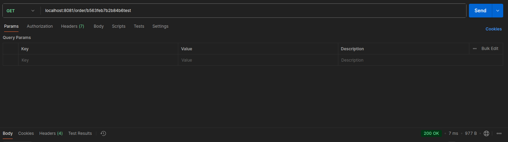

# WB Tech Test Task: Order Service

Микросервис для приема, сохранения и отображения данных о заказе. Получает новые данные о заказе из очереди сообщений Kafka, сохраняет в базе данных PostgreSQL и предоставляет API с кэшированием с помощью Redis для получения информации о заказе.

## Стек

* `Go 1.23`
* `PostgreSQL` и `sqlx` для работы с базой данных
* `Apache Kafka` для получения данных о новых заказах
* `Redis` для кэширования
* `net/http` и `chi` для HTTP-сервера
* `JavaScript` и `HTML` создания для веб-интерфейса

## Запуск и использование

0. Склонируйте репозиторий

    ```bash
    git clone git@github.com:karambo3a/wbtech_test_task.git
    cd wbtech_test_task
    ```
1. Настройте окружение (при необходимости отредактируйте файл)
    ```bash
    cp .env.example .env
    ```
2. Запустите микросервис, базу данных PostgreSQL, очередь сообщений Apache Kafka и базу данных Redis при помощи команды

    ```bash
    docker compose up
    ```
3. Откройте в браузере веб интерфейс `/web/index.html`
4. Сразу после откроется поле для ввода `id` заказа

Скрипт для эмуляции отправки сообщений в очередь можно запустить командой

```bash
go run cmd/producer/main_producer.go
```

## Кэширование

Для кэширования было принято решение использовать NoSQL базу данных Redis, потому что она предоставляет высокопроизводительное in-memory хранилище с простым API.

Также было проведено тестирование при помощи Postman и показано, что использование кэша уменьшает время выполнения запроса.

#### Cache miss


#### Cache hit


## API

Для получения информации о заказе достаточно сделать запрос

`GET http://localhost:8081/order/{order_uid}`

Возвращаемые данные в формате JSON

#### Пример ответ
```
{
  "order_uid": "b563feb7b2b84b6test",
  "track_number": "WBILMTESTTRACK",
  "entry": "WBIL",
  "delivery": {
    "name": "Test Testov",
    "phone": "+9720000000",
    "zip": "2639809",
    "city": "Kiryat Mozkin",
    "address": "Ploshad Mira 15",
    "region": "Kraiot",
    "email": "test@gmail.com"
  },
  "payment": {
    "transaction": "b563feb7b2b84b6test",
    "request_id": "",
    "currency": "USD",
    "provider": "wbpay",
    "amount": 1817,
    "payment_dt": 1637907727,
    "bank": "alpha",
    "delivery_cost": 1500,
    "goods_total": 317,
    "custom_fee": 0
  },
  "items": [
    {
      "chrt_id": 9934930,
      "track_number": "WBILMTESTTRACK",
      "price": 453,
      "rid": "ab4219087a764ae0btest",
      "name": "Mascaras",
      "sale": 30,
      "size": "0",
      "total_price": 317,
      "nm_id": 2389212,
      "brand": "Vivienne Sabo",
      "status": 202
    }
  ],
  "locale": "en",
  "internal_signature": "",
  "customer_id": "test",
  "delivery_service": "meest",
  "shardkey": "9",
  "sm_id": 99,
  "date_created": "2021-11-26T06:22:19Z",
  "oof_shard": "1"
}

```
